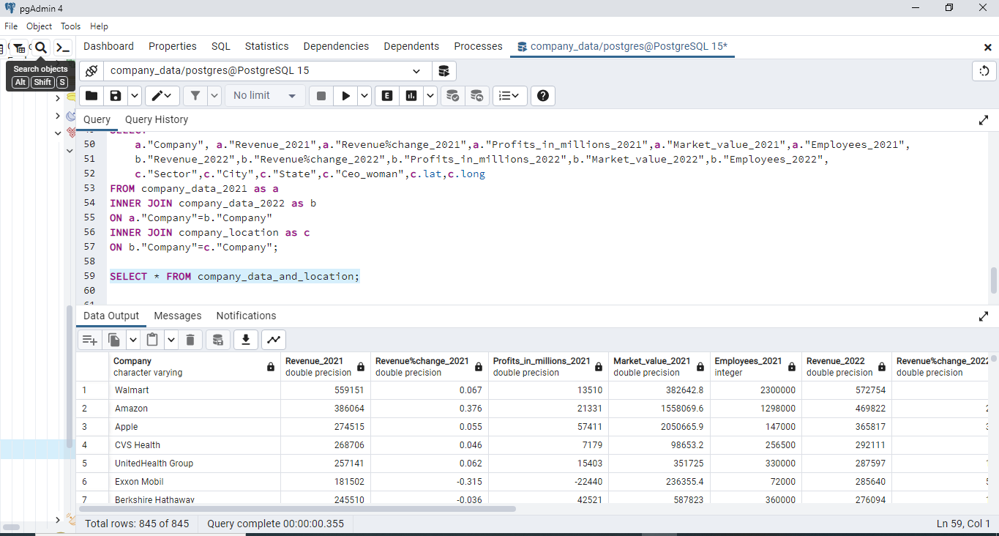
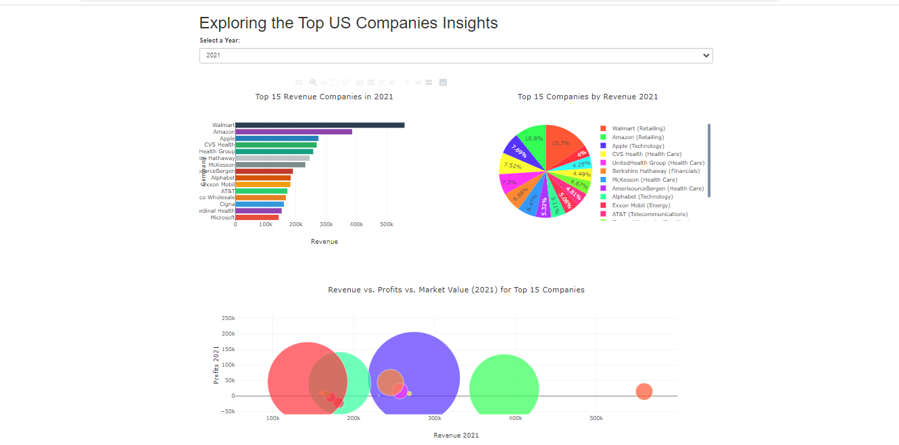
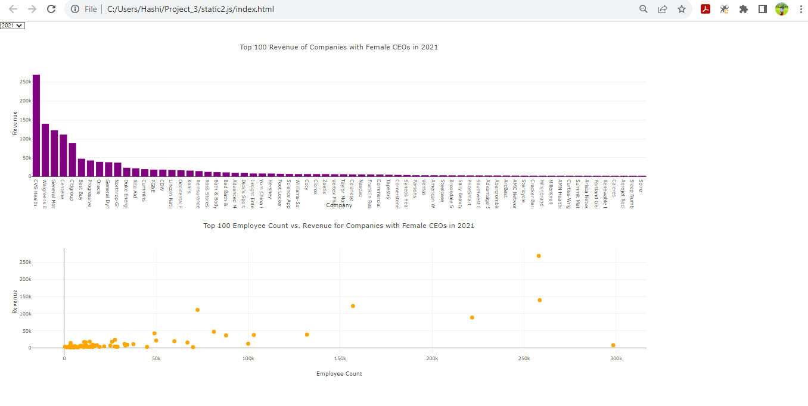
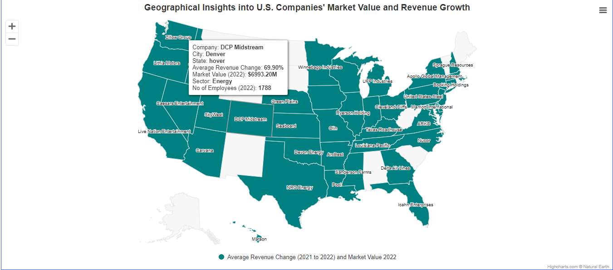
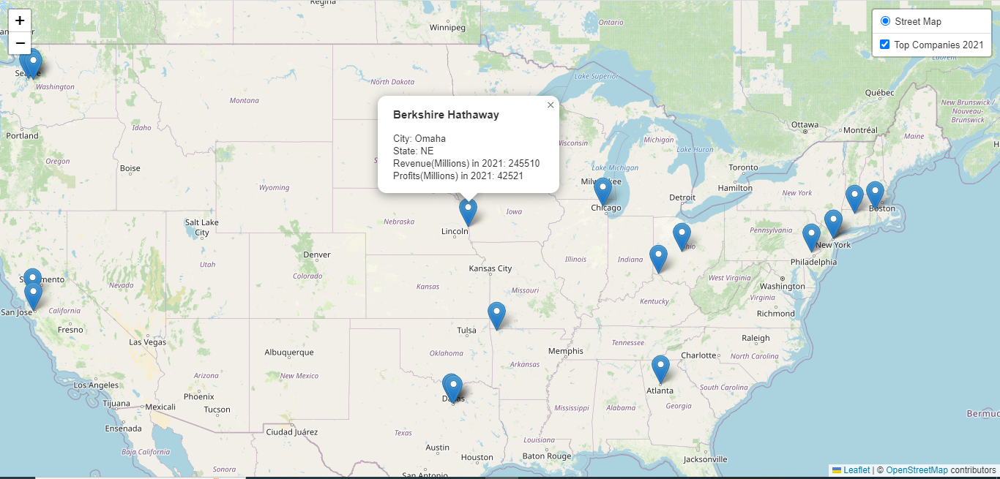

# Exploring Insights from the Largest US Companies

## Overview
The project is about creating an interactive web application that uses  datasets containing information about the largest companies in the United States by revenue, profits, and market value as compiled by the Fortune 500 ranking in 2021 and 2022. This application will be developed using various technologies such as Python Flask for the backend, HTML/CSS and JavaScript for the front end, and a chosen database (SQL) to store and manage the dataset.

The main goal of the project is to provide users with a visually engaging and informative platform to explore and understand the significance of these large US companies within the corporate landscape. The application will feature various data visualizations that present insights from the dataset, highlighting different aspects of the companies' revenues, industries, and other relevant information.

### Team Members
Cindy Li - Clean the dataset

Ruby Landry - Perform SQL query to house the data

Jannatul Ferdos Hashi - Create Interactive Visualization with JavaScript Plotly and Highcharts

Tracey Geneau - Create Interactive Visualization with JavaScript Leaflet

### Why we chose this project: 
•	Insightful Exploration: Users can understand and analyze the financial landscape of top US companies.

•	Informed Decision-Making: Professionals, investors, and policymakers can make strategic choices based on data-driven insights.

•	Educational Value: Researchers can study real-world financial applications.

•	Comparative Insights: Users can compare companies and industries, revealing trends and competition.

•	Engagement: Interactive elements enhance user engagement and data exploration.

### Required Project Files For Analysis:
**raw data folder:** We'll collect these datasets from Kaggle [(https://www.kaggle.com/datasets/ramjasmaurya/fortune-1000-companieslatest)],    
 [(https://www.kaggle.com/datasets/winston56/fortune-500-data-2021)]

In this folder,
- Fortune_1000.csv
- fortune_1000_2021.csv
- fortune_1000_2022.csv

**Resources Folder:** In this folder,
 
1: We have 3 cleaned CSV files:

- company_data_2021.csv
- company_data_2022.csv
- all_company_location.csv

3: Another csv file named **company_location.csv** which contains all companies location  

4: We created our final CSV file named **company_data.csv** using an SQL JOIN query to combine the three cleaned CSV files for further analysis.

### Research Questions We'll Explore in this Project:
-  Which state seems to be a hotspot for top-performing companies in 2021 based on revenue?
  
-  How does the revenue distribution change among the top 15 revenue companies for different selected years?
  
-  What is the contribution of each sector to the total revenue generated by the top 15 companies for a specific year?
  
- How are revenue, profits, and market value correlated among the top 15 companies for a given year?
  
- How does the market value of companies affect the size of bubbles in the bubble chart?
  
- How do the revenue figures of the top 100 companies with female CEOs compare in different selected years?
  
- Among the top 100 companies with female CEOs, which industries are most prominent in terms of revenue generation?
  
- Is there a correlation between the number of employees and the revenue for the top 100 companies with female CEOs?
  
- Do larger employee counts generally correspond to higher revenues, or are there exceptions?
  
-  In which geographic locations are the top 20 companies of 2021 primarily located?

 ### Project Work:
**Step 1:** Once we cleaned the dataset with Jupyter Notebook, we made an ERD Diagram using  [(https://app.quickdatabasediagrams.com/)] to design the SQL schema and properly set data types for all columns.

**Step 2:** We used pgAdmin4 to build tables and combine datasets. This helped us create a single database for our Flask APIs. By joining the three datasets on the "Company" field, we picked the right columns to prevent duplicate values

**Step 3:** Once our database is created, we convert it into a CSV file named "company_data.csv" using Python Flask API routes. This allows us to retrieve the JSON and GeoJSON URLs as well as the JSON and GeoJSON data, which are used to create our interactive visualization.

**Step 4:** Create Interactive Visualization

#### Create an Interactive Dashboard for exploring Top US Companies Insights

**Analysis:**

**Top Revenue Companies(Bar Chart):**
We start by identifying the top revenue generators in our dataset. Through an engaging horizontal bar chart, we showcase the top 15 companies for a chosen year. This chart provides an immediate comparison of revenue figures, enabling us to pinpoint the companies with the highest revenue and their relative positions.

**Sector Distribution of Revenue(Pie Chart):**
Next, we delve into the distribution of revenue across different sectors. Our colorful pie chart visually presents the revenue contributions of the top companies. By exploring this chart, we can identify which sectors dominate the revenue landscape and which ones play a significant role in driving the overall financial performance.

**Revenue vs. Profits vs. Market Value:**
From this bubble chart, we explore the intricate relationships between revenue, profits, and market value. Our interactive bubble chart reveals trends and correlations within these financial metrics. This chart serves as a powerful tool to identify patterns, understand if higher revenue translates to higher profits, and visualize the market value's impact on company positioning. After analyzing the bubble chart we can say that, for a specific company, the higher the profit and revenue, the higher its market value.

**Top 100 Companies’ Insights with Female CEOs**

**Analysis:**

**Bar Chart:** The chart visually displays the top 100 companies that generate the most revenue within the category of companies with female CEOs.The chart helps us see which companies make the most money. We can tell who's at the top and how much better they're doing compared to others. It's like a scoreboard for revenue, showing us the winners and how much they're winning by.

**Scatter Plot:** In the scatter plot, we find insights into the relationship between employee count and revenue for companies with female CEOs. This plot helps us understand whether there's a connection between having more employees and generating higher revenue in these companies.

**Geographical Insights into U.S. Companies’ Market Value and Revenue Growth**

**Analysis:**

In this map-based visualization, we explore U.S. companies' revenue changes and market value. Users can identify a specific company with significant revenue shifts, the company's region understand the distribution of profits, and explore company-specific details through tooltips. The visualizations help uncover potential geographical patterns, sector insights, average revenue change, and market value.

**Top 20 Companies for 2021 with Geographic Locations**

**Analysis:**

The top 20 companies for 2021 were determined by total revenue in the millions. What we found was that not all of the companies that had high revenues turned a profit.  These included Cardinal Health, AT&T, Exxon Mobil, & AmerisourceBergen. 
It was also observed that the west was home to only 5 of the top 20 companies in both Washington and California.  The rest of the companies could be found in and to the North & East of Dallas Texas for 2021.

**Limitations:**

Incomplete historical data: 

- One of the raw datasets lacked location information for the year 2021, This inconsistency might affect the accuracy of comparisons and analyses involving location-based metrics.
  
Currency Conversion and Inflation: 

- If the dataset contains financial data in different currencies or doesn't account for inflation, the financial metrics might not be directly comparable or accurately reflect the companies' performance over time.

Static Data Snapshot:
- The dataset provides a snapshot of data for specific years (2021 and 2022). This static view might not capture dynamic changes or trends that occur within companies throughout the year.

**Recommendations:**

Real-time updates: 
- Exploring options for incorporating real-time updates to provide users with the most current insights into the evolving corporate landscape.

Contextual Insights: 
- To address the lack of contextual data, we suggest integrating external economic and industry-related information to provide users with a comprehensive view of the factors influencing the companies' performance.

